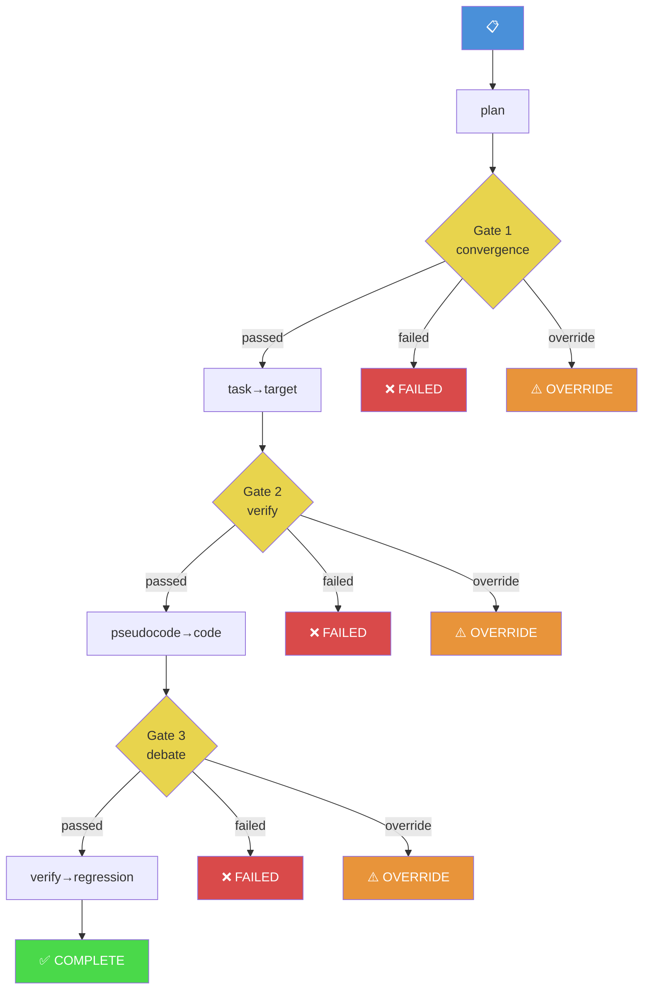

# Toulmin Tree — Behavior Tree Visualization

Render the current Toulmin task as a visual behavior tree showing every node in the task's lifecycle: phases, gates, verifications, debates, overrides, and external reviews. Also surfaces context partitions (topic shifts) and cross-session references.

## Input

1. Read `.claude/toulmin-state.local.md` — current state
2. Scan `{gate_dir}/` — all gate documents and review reports
3. Scan `docs/toulmin/` — historical task directories (for cross-session context)
4. Optionally: scan the current conversation for topic shifts (L0 signal data)

## Execution

### Step 1: Build the behavior tree

Traverse the state and gate documents to construct a tree:

```
[Task: <slug>] (mode: structured|vibe)
├── Phase: plan ──→ Gate 1: convergence  [✅|❌|⚠️|●|○]
│   ├── Claim: <one-line>
│   ├── Decision: <path chosen>
│   ├── Rejected: <alternatives>
│   └── Override: [if any, with reason excerpt]
├── Phase: task
├── Phase: target
├── Phase: pseudocode ──→ Gate 2: verification  [✅|❌|⚠️|●|○]
│   ├── L1: assumptions [N listed, M high-risk]
│   ├── L2: boundaries [N dimensions]
│   ├── L3: failure modes [N modes, M high-severity]
│   ├── L3.5: causal traces [N traces]
│   ├── L4: fatal assumption ["..."]
│   ├── Audit: [STANDS|NARROW|REFUTED] [N findings]
│   └── Override: [if any]
├── Phase: code
├── Phase: verify ──→ Gate 3: debate  [✅|❌|⚠️|●|○]
│   ├── R1: [N findings] (ACCEPT/M/REBUT/K/DEMOTE/K)
│   ├── R2: responses
│   ├── R3: verdict [✅|⚠️|❌]
│   ├── Premortem: [N death paths, top risk]
│   ├── Qualify: [confidence, N hard/S soft boundaries]
│   └── Override: [if any]
└── Phase: regression
    ├── Qualifier: <scope statement excerpt>
    └── Status: [complete|pending]
```

Node status indicators:
- ● active (current phase/gate)
- ✅ passed
- ❌ failed
- ⚠️ overridden / conditional pass
- ○ pending (not yet reached)

### Step 2: Add context partitions

If the state file has partition data (`partitions` field), render as a secondary tree:

```
Context Partitions:
├── [1] P0: <task slug> ● (root, iteration 0-45)
├── [2] P1: <drift topic> (iteration 46-52, ⚠️ drift detected)
└── [3] P0: <task slug> ● (iteration 53-, recovered)
```

If no partition data exists, note: "No partition tracking active. Context drift is not being monitored."

### Step 3: Add cross-session references

If `docs/toulmin/` contains directories beyond the current gate_dir:

```
Cross-Session Context:
├── 2026-07-01-auth-refactor/ — gate-2: ✅, gate-3: ⚠️ (override×1)
├── 2026-07-03-permission-model/ — gate-2: ✅, gate-3: ✅
└── 2026-07-05-api-rate-limit/ — gate-2: ❌ → ⚠️ (override×2) ⚠️ SIMILAR TASK
```

Match against current task slug (>3 char overlap → flag as possible related).

### Step 4: Render Mermaid diagram

Generate a Mermaid flowchart:



Adjust node colors to match actual gate verdicts.

### Step 5: Present summary

```
## Toulmin Tree — <task-slug>

[Behavior tree text view]

---

[Mermaid diagram — gate progress flow]

---

### Stats
| Metric | Value |
|--------|-------|
| Gates passed | N/3 |
| Gates overridden | N |
| Total iterations | N |
| Review tools applied | verify, debate, audit, premortem, qualify |
| Confidence | [from qualifier] |
| Cross-session tasks | N (K similar) |

### Risk indicators
- [If override_count > 0]: ⚠️ N overrides — gate discipline risk
- [If gate_attempts > 2]: ⚠️ Retry count high — design may need rethinking
- [If similar past tasks exist]: ⚠️ Past lessons may apply — review recommended
- [If no qualifier yet]: ○ Qualify not run — scattered findings not synthesized
```

## Post-execution

- This is read-only. No state changes, no document writes.
- If the user asks to explore a specific node, read the corresponding gate document for details.

Output in the language specified by `lang` field.
